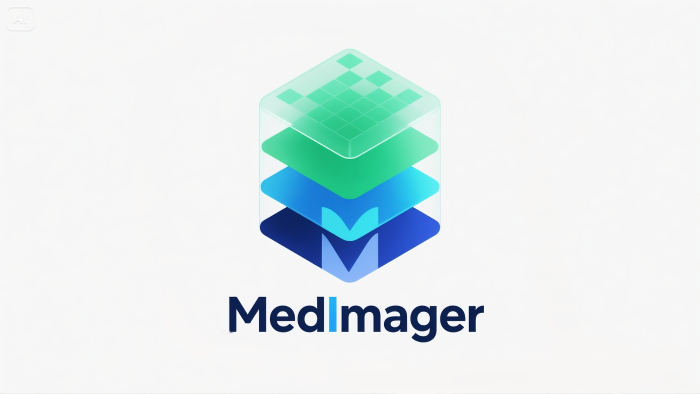

<div align="center">

**English** | [简体中文](README_zh.md)

</div>

# MedImager - A Modern DICOM Viewer & Image Analysis Tool

## 1. Project Vision

Create a powerful, user-friendly, and research-oriented open-source medical image viewer. MedImager aims to provide smooth image interaction, multi-format support (DICOM, PNG, etc.), and advanced analysis features for academic and clinical workflows, aspiring to be an open-source alternative to RadiAnt.

## 2. Core Features (Roadmap)

### V1.0 - Core Features
- [x] **File Handling:**
    - [x] Open and parse DICOM series from folders.
    - [x] Open single image files (PNG, JPG, BMP).
    - [x] DICOM tag viewer.
- [x] **Image Display:**
    - [x] Smooth pan and zoom 2D viewer.
    - [ ] Multi-viewport for image comparison.
    - [ ] Display patient info and image overlays (scale, orientation marker).
- [x] **Image Interaction Tools:**
    - [x] **Windowing:** Interactive adjustment of HU window width/level (WW/WL).
    - [x] **Measurement Tools:**
        - [x] Ruler tool for distance measurement.
        - [x] Ellipse/rectangle ROI tools.
    - [x] **ROI Analysis:** Calculate statistics within ROI (mean, std, area, max/min HU).

### V2.0 - Advanced Features
- [ ] **Multi-Planar Reconstruction (MPR):** View axial, sagittal, and coronal planes from 3D volume data.
- [ ] **3D Volume Rendering:** Basic 3D visualization of DICOM series.
- [ ] **Image Fusion:** Overlay two different series (e.g., PET/CT).
- [ ] **Annotation & Export:**
    - [ ] Save annotation info (ROIs, measurements).
    - [ ] Export annotated views as PNG/JPG images.
- [ ] **Plugin System:** Allow users to extend features via custom Python scripts for research.

## 3. Tech Stack

* **Language:** Python 3.9+
* **GUI Framework:** PySide6 (LGPL)
* **DICOM Parsing:** pydicom
* **Numerical/Image Processing:** NumPy, SciPy, scikit-image
* **2D/3D Visualization:** Qt Graphics View Framework (2D), VTK 9+ (3D)
* **Packaging:** PyInstaller
* **i18n:** Qt Linguist (`pylupdate6`, `lrelease`)

## 4. Project Structure

The project follows an MVC-like pattern to separate data logic, UI, and user interaction.

```
medimager/
├── main.py                 # Application entry point
├── icons/                  # UI icons
├── translations/           # Translation files (.ts, .qm)
│
├── core/                   # Core logic, UI-independent
│   ├── __init__.py
│   ├── dicom_parser.py     # DICOM loading/parsing via pydicom
│   ├── image_data_model.py # Data model for single image or DICOM series
│   ├── roi.py              # ROI shapes and logic
│   └── analysis.py         # Statistical calculations (HU stats, etc.)
│
├── ui/                     # All UI components (PySide6)
│   ├── __init__.py
│   ├── main_window.py      # Main window, layout, menus, toolbar
│   ├── image_viewer.py     # Core 2D image viewer (QGraphicsView)
│   ├── viewport.py         # Standalone viewport with image_viewer
│   ├── panels/             # Dockable panels
│   │   ├── __init__.py
│   │   ├── series_panel.py     # Loaded series/thumbnails panel
│   │   ├── dicom_tag_panel.py  # DICOM tag panel
│   │   └── analysis_panel.py   # ROI analysis panel
│   └── tools/              # Interactive tool UI implementations
│       ├── __init__.py
│       ├── base_tool.py        # Abstract base class for tools
│       ├── pan_zoom_tool.py    # Pan/zoom tool
│       ├── window_level_tool.py# Window/level tool
│       ├── measurement_tool.py # Measurement tool
│
├── utils/                  # General utilities
│   ├── __init__.py
│   ├── logger.py           # Global logging config
│   └── settings.py         # User settings save/load
│
├── tests/                  # Unit/integration tests
│   ├── __init__.py
│   ├── test_dicom_parser.py
│   └── test_roi.py
│
├── requirements.txt        # Python dependencies
└── README_zh.md            # Chinese documentation
```

## 5. Usage

1.  **Clone the repo:**
    ```bash
    git clone <your-repo-url>
    cd MedImager
    ```

2.  **Create and activate a virtual environment:**
    ```bash
    python -m venv venv
    # Windows
    venv\Scripts\activate
    # macOS / Linux
    source venv/bin/activate
    ```

3.  **Install dependencies:**
    ```bash
    pip install -r requirements.txt
    ```

4.  **Run the app:**
    ```bash
    python medimager/main.py  # Recommended
    ```
    or
    ```bash
    python -m medimager.main  # For development
    ```

---
*Initial `requirements.txt` content:*

```
PySide6
pydicom
numpy
scipy
scikit-image
pyinstaller
# vtk # Add when developing 3D features
```

---

## Contributors

[](https://github.com/1985312383/MedImager/graphs/contributors)

