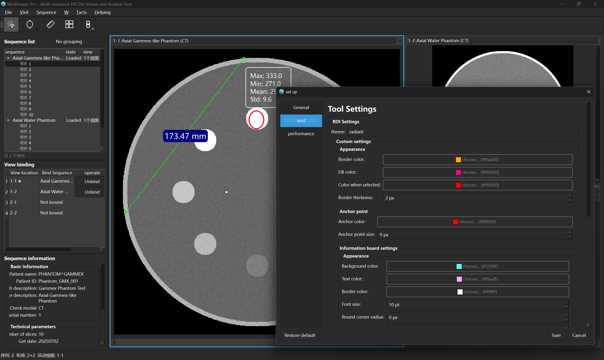

<div align="center">


</div>

<div align="center">

# MedImager
**Ein moderner, plattformübergreifender DICOM-Viewer und Bildanalyse-Tool**

[](https://www.gnu.org/licenses/gpl-3.0)
[](https://www.python.org/)
[](https://www.qt.io/qt-for-python)
[](https://github.com/psf/black)
[](https://github.com/1985312383/MedImager)

[English](README.md) | [简体中文](README_zh.md) | **Deutsch** | [Español](README_es.md) | [Français](README_fr.md)

</div>

MedImager ist ein leistungsstarker, benutzerfreundlicher und forschungsorientierter Open-Source-Medizinbildbetrachter. Er zielt darauf ab, reibungslose Bildinteraktion, Multi-Format-Unterstützung (DICOM, PNG usw.) und erweiterte Analysefunktionen für akademische und klinische Arbeitsabläufe zu bieten.

## 1. Projektvision

Erstellen Sie einen leistungsstarken, benutzerfreundlichen und forschungsorientierten Open-Source-Medizinbildbetrachter. MedImager zielt darauf ab, reibungslose Bildinteraktion, Multi-Format-Unterstützung (DICOM, PNG usw.) und erweiterte Analysefunktionen für akademische und klinische Arbeitsabläufe zu bieten und strebt an, eine Open-Source-Alternative zu RadiAnt zu sein.

<div align="center">



</div>

## 2. Kernfunktionen (Roadmap)

### ✅ V1.0 - Kernfunktionen (ABGESCHLOSSEN)
- [x] **Dateiverarbeitung:**
    - [x] DICOM-Serien aus Ordnern öffnen und analysieren.
    - [x] Einzelne Bilddateien öffnen (PNG, JPG, BMP).
    - [x] DICOM-Tag-Viewer.
- [x] **Bildanzeige:**
    - [x] Reibungsloser Pan- und Zoom-2D-Viewer.
    - [x] Multi-Viewport für Bildvergleiche mit flexiblen Layouts.
    - [x] Anzeige von Patienteninformationen und Bildüberlagerungen (Maßstab, Orientierungsmarker).
- [x] **Bildinteraktions-Tools:**
    - [x] **Fensterung:** Interaktive Anpassung der HU-Fensterbreite/-ebene (WW/WL) mit Symbolleisten-Voreinstellungen.
    - [x] **Messwerkzeuge:**
        - [x] Lineal-Tool für Entfernungsmessungen.
        - [x] Winkelmesswerkzeug.
        - [x] Ellipse/Rechteck/Kreis-ROI-Tools.
    - [x] **ROI-Analyse:** Berechnung von Statistiken innerhalb der ROI (Mittelwert, Std, Fläche, max/min HU).
    - [x] **Bildtransformationen:** Spiegeln (horizontal/vertikal), Drehen (90° links/rechts), Invertieren, mit separatem Zustand pro Ansicht.
    - [x] **Cine-Wiedergabe:** Automatische Wiedergabe durch Schichten mit einstellbarer Bildrate.
    - [x] **Bildexport:** Aktuelle Ansicht als PNG/JPG exportieren oder in die Zwischenablage kopieren.
- [x] **Erweiterte Funktionen:**
    - [x] **Multi-Serien-Management:** Gleichzeitiges Laden und Verwalten mehrerer DICOM-Serien.
    - [x] **Serien-View-Bindung:** Flexibles Bindungssystem mit automatischer Zuweisung und manueller Kontrolle.
    - [x] **Synchronisation:** Viewport-übergreifende Synchronisation für Position, Pan, Zoom und Fenster/Ebene.
    - [x] **Layout-System:** Raster-Layouts (1×1 bis 3×4) und spezielle Layouts (vertikale/horizontale Teilung, dreispaltig).
- [x] **Benutzeroberfläche:**
    - [x] Moderne mehrsprachige Oberfläche (Chinesisch/Englisch).
    - [x] Anpassbares Themensystem (helle/dunkle Themen) mit Echtzeit-Umschaltung.
    - [x] Vollständiges Einstellungssystem mit Tool-Erscheinungsanpassung.
    - [x] Einheitliche Symbolleiste mit themenadaptiven Symbolen.
    - [x] Andockbares Panel-Layout.

### V2.0 - Erweiterte Funktionen
- [ ] **Multi-Planar-Rekonstruktion (MPR):** Anzeige axialer, sagittaler und koronaler Ebenen aus 3D-Volumendaten.
- [ ] **3D-Volumen-Rendering:** Grundlegende 3D-Visualisierung von DICOM-Serien.
- [ ] **Bildfusion:** Überlagerung zweier verschiedener Serien (z.B. PET/CT).
- [ ] **Annotationspersistenz:** Speichern und Wiederladen von Annotationen (ROIs, Messungen) über Sitzungen hinweg.
- [ ] **Plugin-System:** Ermöglicht Benutzern, Funktionen über benutzerdefinierte Python-Skripte für die Forschung zu erweitern.

## 3. Tech Stack

* **Sprache:** Python 3.9+
* **GUI-Framework:** PySide6 (LGPL)
* **DICOM-Parsing:** pydicom
* **Numerische/Bildverarbeitung:** NumPy
* **2D/3D-Visualisierung:** Qt Graphics View Framework (2D), VTK 9+ (3D)
* **Verpackung:** PyInstaller
* **i18n:** Qt Linguist (`pylupdate6`, `lrelease`)

## 4. Projektstruktur

Das Projekt folgt einem MVC-ähnlichen Muster zur Trennung von Datenlogik, UI und Benutzerinteraktion.

```
medimager/
├── main.py                 # Anwendungseinstiegspunkt
├── icons/                  # UI-Symbole und SVG-Ressourcen
├── translations/           # Übersetzungsdateien (.ts, .qm)
├── themes/                 # Theme-Konfigurationsdateien
│   ├── ui/                 # UI-Themes (dark.toml, light.toml)
│   ├── roi/                # ROI-Erscheinungsthemes
│   └── measurement/        # Messwerkzeug-Themes
│
├── core/                   # Kernlogik, UI-unabhängig (MVC-Modell)
│   ├── __init__.py
│   ├── dicom_parser.py     # DICOM-Laden/Parsing über pydicom
│   ├── image_data_model.py # Datenmodell für einzelnes Bild oder DICOM-Serie
│   ├── multi_series_manager.py # Multi-Serien-Management und Layout-Kontrolle
│   ├── series_view_binding.py  # Serien-View-Bindungsmanagement
│   ├── sync_manager.py     # Viewport-übergreifende Synchronisation
│   ├── roi.py              # ROI-Formen und -Logik
│   └── analysis.py         # Statistische Berechnungen (HU-Statistiken usw.)
│
├── ui/                     # Alle UI-Komponenten (MVC View & Controller)
│   ├── __init__.py
│   ├── main_window.py      # Hauptfenster mit Multi-Serien-Unterstützung
│   ├── main_toolbar.py     # Einheitliches Symbolleisten-Management (Tools, Layout, Sync)
│   ├── image_viewer.py     # Kern-2D-Bildbetrachter (QGraphicsView)
│   ├── viewport.py         # Eigenständiger Viewport mit image_viewer
│   ├── multi_viewer_grid.py# Multi-Viewport-Raster-Layout-Manager
│   ├── panels/             # Andockbare Panels
│   │   ├── __init__.py
│   │   ├── series_panel.py     # Multi-Serien-Management-Panel
│   │   ├── dicom_tag_panel.py  # DICOM-Tag-Panel
│   │   └── analysis_panel.py   # ROI-Analyse-Panel
│   ├── tools/              # Interaktive Tool-Implementierungen
│   │   ├── __init__.py
│   │   ├── base_tool.py        # Abstrakte Basisklasse für Tools
│   │   ├── default_tool.py     # Standard-Zeiger/Pan/Zoom/Fenster-Tool
│   │   ├── roi_tool.py         # ROI-Tools (Ellipse, Rechteck, Kreis)
│   │   └── measurement_tool.py # Entfernungsmess-Tool
│   ├── dialogs/            # Dialog-Fenster
│   │   ├── custom_wl_dialog.py # Benutzerdefinierter Fenster/Ebene-Dialog
│   │   └── settings_dialog.py  # Anwendungseinstellungs-Dialog
│   └── widgets/            # Benutzerdefinierte UI-Widgets
│       ├── __init__.py
│       ├── magnifier.py        # Lupen-Widget
│       ├── roi_stats_box.py    # ROI-Statistik-Anzeige
│       └── layout_grid_selector.py # Layout-Auswahl-Widget
│
├── utils/                  # Allgemeine Hilfsprogramme (MVC-Modell-Unterstützung)
│   ├── __init__.py
│   ├── logger.py           # Globale Logging-Konfiguration
│   ├── settings.py         # Benutzereinstellungs-Management
│   ├── theme_manager.py    # Themensystem mit Symbol-Management
│   └── i18n.py             # Internationalisierungs-Hilfsprogramme
│
├── tests/                  # Unit-/Integrationstests
│   ├── __init__.py
│   ├── dcm/                # Test-DICOM-Daten
│   ├── scripts/            # Testdaten-Generierungsskripte
│   ├── test_dicom_parser.py
│   ├── test_roi.py
│   └── test_multi_series_components.py
│
├── pyproject.toml          # Projekt-Metadaten und Abhängigkeiten
└── README_zh.md            # Chinesische Dokumentation
```

## 5. Verwendung

Stellen Sie zunächst sicher, dass Sie [uv](https://github.com/astral-sh/uv) installiert haben. Es ist ein extrem schneller Python-Paket-Installer und -Resolver.

1.  **Repository klonen:**
    ```bash
    git clone https://github.com/1985312383/MedImager.git
    cd MedImager
    ```

2.  **Umgebung einrichten und Abhängigkeiten installieren:**
    ```bash
    # Virtuelle Umgebung erstellen und Abhängigkeiten aus pyproject.toml synchronisieren
    uv venv
    uv sync
    ```

3.  **App ausführen:**
    ```bash
    # `uv run` führt den Befehl innerhalb der virtuellen Umgebung des Projekts aus,
    # wodurch die Notwendigkeit vermieden wird, sie in Ihrer Shell zu aktivieren.
    uv run python medimager/main.py
    ```
    Für Entwickler, die eine aktive Umgebung bevorzugen:
    ```bash
    # Um die Umgebung in Ihrer aktuellen Shell zu aktivieren:
    # Windows
    .venv\\Scripts\\activate
    # macOS / Linux
    source .venv/bin/activate
    
    # Dann können Sie Befehle direkt ausführen:
    python medimager/main.py
    ```

---

## 🤝 Mitwirken

Beiträge sind willkommen! Ob Sie einen Fehler beheben, eine Funktion hinzufügen oder die Dokumentation verbessern, Ihre Hilfe wird geschätzt. Bitte zögern Sie nicht, ein Issue zu öffnen oder einen Pull Request zu senden.

## 📄 Lizenz

Dieses Projekt ist unter der GNU GENERAL PUBLIC LICENSE lizenziert. Siehe die [LICENSE](LICENSE)-Datei für Details.

---

## Mitwirkende

[](https://github.com/1985312383/MedImager/graphs/contributors)

