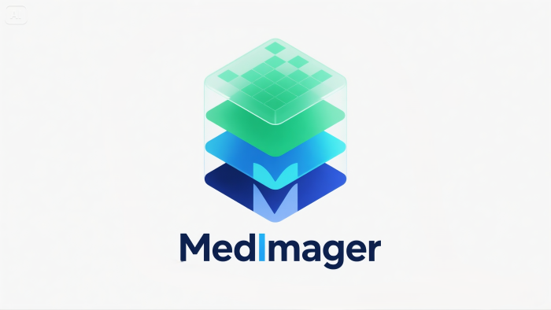
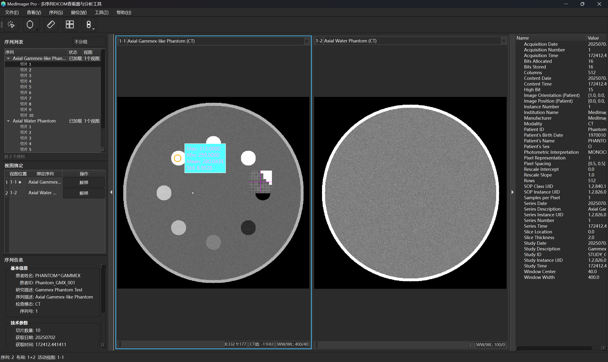

<div align="center">



</div>

<div align="center">

# MedImager
**Un Visualiseur DICOM et Outil d'Analyse d'Images Moderne et Multiplateforme**

[](https://www.gnu.org/licenses/gpl-3.0)
[](https://www.python.org/)
[](https://www.qt.io/qt-for-python)
[](https://github.com/psf/black)
[](https://github.com/1985312383/MedImager)

[English](README.md) | [简体中文](README_zh.md) | [Deutsch](README_de.md) | [Español](README_es.md) | **Français**

</div>

MedImager est un visualiseur d'images médicales open source puissant, convivial et orienté recherche. Il vise à fournir une interaction fluide avec les images, un support multi-format (DICOM, PNG, etc.) et des fonctionnalités d'analyse avancées pour les flux de travail académiques et cliniques.

## 1. Vision du Projet

Créer un visualiseur d'images médicales open source puissant, convivial et orienté recherche. MedImager vise à fournir une interaction fluide avec les images, un support multi-format (DICOM, PNG, etc.) et des fonctionnalités d'analyse avancées pour les flux de travail académiques et cliniques, aspirant à être une alternative open source à RadiAnt.

<div align="center">



</div>

## 2. Fonctionnalités Principales (Feuille de Route)

### ✅ V1.0 - Fonctionnalités Principales (TERMINÉ)
- [x] **Gestion des Fichiers :**
    - [x] Ouvrir et analyser les séries DICOM depuis les dossiers.
    - [x] Ouvrir des fichiers d'image individuels (PNG, JPG, BMP).
    - [x] Visualiseur de balises DICOM.
- [x] **Affichage d'Images :**
    - [x] Visualiseur 2D avec panoramique et zoom fluides.
    - [x] Multi-viewport pour la comparaison d'images avec des mises en page flexibles.
    - [x] Affichage des informations patient et des superpositions d'image (échelle, marqueur d'orientation).
- [x] **Outils d'Interaction d'Images :**
    - [x] **Fenêtrage :** Ajustement interactif de la largeur/niveau de fenêtre HU (WW/WL).
    - [x] **Outils de Mesure :**
        - [x] Outil règle pour la mesure de distance.
        - [x] Outils ROI ellipse/rectangle/cercle.
    - [x] **Analyse ROI :** Calculer les statistiques dans la ROI (moyenne, écart-type, aire, HU max/min).
- [x] **Fonctionnalités Avancées :**
    - [x] **Gestion Multi-Séries :** Charger et gérer plusieurs séries DICOM simultanément.
    - [x] **Liaison Série-Vue :** Système de liaison flexible avec attribution automatique et contrôle manuel.
    - [x] **Synchronisation :** Synchronisation inter-viewport pour position, panoramique, zoom et fenêtre/niveau.
    - [x] **Système de Mise en Page :** Mises en page en grille (1×1 à 3×4) et mises en page spéciales (division verticale/horizontale, triple colonne).
- [x] **Interface Utilisateur :**
    - [x] Interface multilingue moderne (Chinois/Anglais).
    - [x] Système de thèmes personnalisable (thèmes clair/sombre) avec commutation en temps réel.
    - [x] Système de paramètres complet avec personnalisation de l'apparence des outils.
    - [x] Barre d'outils unifiée avec icônes adaptatives au thème.
    - [x] Mise en page de panneau ancrable.

### V2.0 - Fonctionnalités Avancées
- [ ] **Reconstruction Multi-Planaire (MPR) :** Visualiser les plans axial, sagittal et coronal à partir de données de volume 3D.
- [ ] **Rendu de Volume 3D :** Visualisation 3D de base des séries DICOM.
- [ ] **Fusion d'Images :** Superposer deux séries différentes (ex. PET/CT).
- [ ] **Annotation et Export :**
    - [ ] Sauvegarder les informations d'annotation (ROIs, mesures).
    - [ ] Exporter les vues annotées en images PNG/JPG.
- [ ] **Système de Plugins :** Permettre aux utilisateurs d'étendre les fonctionnalités via des scripts Python personnalisés pour la recherche.

## 3. Stack Technologique

* **Langage :** Python 3.9+
* **Framework GUI :** PySide6 (LGPL)
* **Analyse DICOM :** pydicom
* **Traitement Numérique/Images :** NumPy
* **Visualisation 2D/3D :** Qt Graphics View Framework (2D), VTK 9+ (3D)
* **Empaquetage :** PyInstaller
* **i18n :** Qt Linguist (`pylupdate6`, `lrelease`)

## 4. Structure du Projet

Le projet suit un modèle similaire à MVC pour séparer la logique des données, l'UI et l'interaction utilisateur.

```
medimager/
├── main.py                 # Point d'entrée de l'application
├── icons/                  # Icônes UI et ressources SVG
├── translations/           # Fichiers de traduction (.ts, .qm)
├── themes/                 # Fichiers de configuration de thèmes
│   ├── ui/                 # Thèmes UI (dark.toml, light.toml)
│   ├── roi/                # Thèmes d'apparence ROI
│   └── measurement/        # Thèmes d'outils de mesure
│
├── core/                   # Logique centrale, indépendante de l'UI (Modèle MVC)
│   ├── __init__.py
│   ├── dicom_parser.py     # Chargement/analyse DICOM via pydicom
│   ├── image_data_model.py # Modèle de données pour image unique ou série DICOM
│   ├── multi_series_manager.py # Gestion multi-séries et contrôle de mise en page
│   ├── series_view_binding.py  # Gestion de liaison série-vue
│   ├── sync_manager.py     # Synchronisation inter-viewport
│   ├── roi.py              # Formes ROI et logique
│   └── analysis.py         # Calculs statistiques (statistiques HU, etc.)
│
├── ui/                     # Tous les composants UI (Vue et Contrôleur MVC)
│   ├── __init__.py
│   ├── main_window.py      # Fenêtre principale avec support multi-séries
│   ├── main_toolbar.py     # Gestion de barre d'outils unifiée (outils, mise en page, sync)
│   ├── image_viewer.py     # Visualiseur d'images 2D central (QGraphicsView)
│   ├── viewport.py         # Viewport autonome avec image_viewer
│   ├── multi_viewer_grid.py# Gestionnaire de mise en page de grille multi-viewport
│   ├── panels/             # Panneaux ancrables
│   │   ├── __init__.py
│   │   ├── series_panel.py     # Panneau de gestion multi-séries
│   │   ├── dicom_tag_panel.py  # Panneau de balises DICOM
│   │   └── analysis_panel.py   # Panneau d'analyse ROI
│   ├── tools/              # Implémentations d'outils interactifs
│   │   ├── __init__.py
│   │   ├── base_tool.py        # Classe de base abstraite pour les outils
│   │   ├── default_tool.py     # Outil par défaut pointeur/panoramique/zoom/fenêtre
│   │   ├── roi_tool.py         # Outils ROI (ellipse, rectangle, cercle)
│   │   └── measurement_tool.py # Outil de mesure de distance
│   ├── dialogs/            # Fenêtres de dialogue
│   │   ├── custom_wl_dialog.py # Dialogue personnalisé fenêtre/niveau
│   │   └── settings_dialog.py  # Dialogue de paramètres d'application
│   └── widgets/            # Widgets UI personnalisés
│       ├── __init__.py
│       ├── magnifier.py        # Widget loupe
│       ├── roi_stats_box.py    # Affichage des statistiques ROI
│       └── layout_grid_selector.py # Widget sélecteur de mise en page
│
├── utils/                  # Utilitaires généraux (Support Modèle MVC)
│   ├── __init__.py
│   ├── logger.py           # Configuration de logging globale
│   ├── settings.py         # Gestion des paramètres utilisateur
│   ├── theme_manager.py    # Système de thèmes avec gestion d'icônes
│   └── i18n.py             # Utilitaires d'internationalisation
│
├── tests/                  # Tests unitaires/intégration
│   ├── __init__.py
│   ├── dcm/                # Données DICOM de test
│   ├── scripts/            # Scripts de génération de données de test
│   ├── test_dicom_parser.py
│   ├── test_roi.py
│   └── test_multi_series_components.py
│
├── pyproject.toml          # Métadonnées du projet et dépendances
└── README_zh.md            # Documentation chinoise
```

## 5. Utilisation

D'abord, assurez-vous d'avoir [uv](https://github.com/astral-sh/uv) installé. C'est un installateur et résolveur de paquets Python extrêmement rapide.

1.  **Cloner le dépôt :**
    ```bash
    git clone https://github.com/1985312383/MedImager.git
    cd MedImager
    ```

2.  **Configurer l'Environnement et Installer les Dépendances :**
    ```bash
    # Créer un environnement virtuel et synchroniser les dépendances depuis pyproject.toml
    uv venv
    uv sync
    ```

3.  **Exécuter l'application :**
    ```bash
    # `uv run` exécute la commande dans l'environnement virtuel du projet,
    # évitant le besoin de l'activer dans votre shell.
    uv run python medimager/main.py
    ```
    Pour les développeurs qui préfèrent un environnement actif :
    ```bash
    # Pour activer l'environnement dans votre shell actuel :
    # Windows
    .venv\\Scripts\\activate
    # macOS / Linux
    source .venv/bin/activate
    
    # Ensuite vous pouvez exécuter les commandes directement :
    python medimager/main.py
    ```

---

## 🤝 Contribuer

Les contributions sont les bienvenues ! Que vous corrigiez un bug, ajoutiez une fonctionnalité ou amélioriez la documentation, votre aide est appréciée. N'hésitez pas à ouvrir une issue ou soumettre une pull request.

## 📄 Licence

Ce projet est sous licence GNU GENERAL PUBLIC LICENSE. Voir le fichier [LICENSE](LICENSE) pour les détails.

---

## Contributeurs

[](https://github.com/1985312383/MedImager/graphs/contributors)

